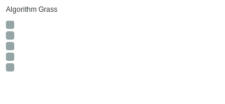

# algorithm-journey
This is an auto push repository for Baekjoon Online Judge created with [BaekjoonHub](https://github.com/BaekjoonHub/BaekjoonHub).

## 📊 풀이 현황

<!-- STATS:START -->
- 총 풀이 수: **5문제**
- 백준: **0문제**
- 프로그래머스: **5문제**
<!-- STATS:END -->

## 🛠 언어 통계

<!-- LANG:START -->
| Language | Count | Ratio |
|---|---:|---:|
| C++ | 5 | ██████████ 100% |
<!-- LANG:END -->

## 🆕 최근 풀이

<!-- RECENT:START -->
- `프로그래머스/1/468371. 노란불 신호등/노란불 신호등.cpp`
- `프로그래머스/1/468370. 중요한 단어를 스포 방지/중요한 단어를 스포 방지.cpp`
- `프로그래머스/0/340203. ［PCCE 기출문제］ 5번 ／ 심폐소생술/［PCCE 기출문제］ 5번 ／ 심폐소생술.cpp`
- `프로그래머스/0/340202. ［PCCE 기출문제］ 6번 ／ 물 부족/［PCCE 기출문제］ 6번 ／ 물 부족.cpp`
- `프로그래머스/0/340201. ［PCCE 기출문제］ 7번 ／ 버스/［PCCE 기출문제］ 7번 ／ 버스.cpp`
<!-- RECENT:END -->

## 🌱 Algorithm Grass

